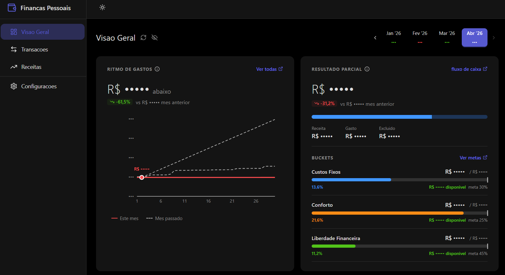
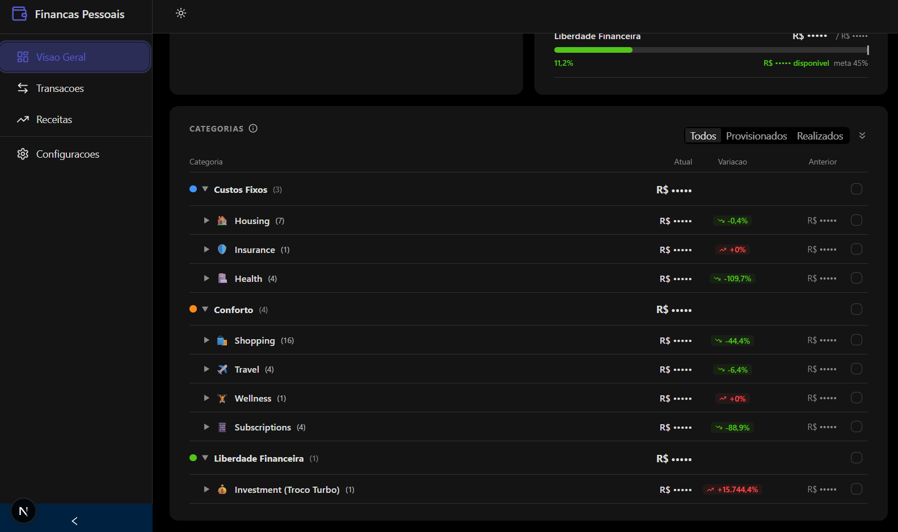
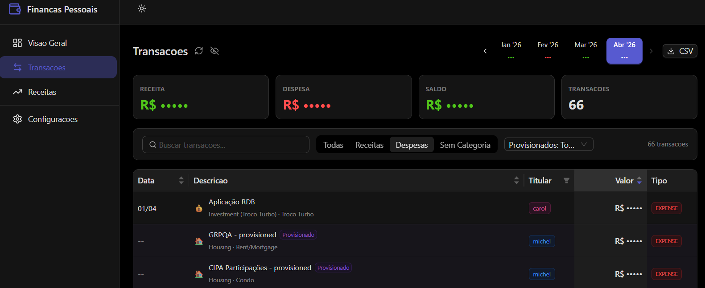
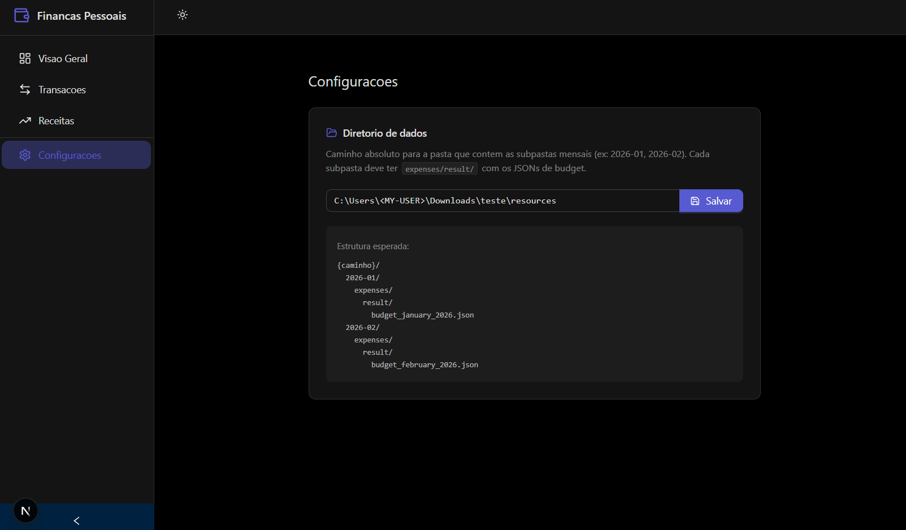

# personal-finance-viewer

Web app for visualizing monthly budget reports generated by [personal-finance](https://github.com/icesnow10/personal-finance).







## Features

| Page | What it shows |
|---|---|
| **Visao Geral** | Spending pace chart (current vs previous month), partial result with income/expense bar, budget bucket progress (Custos Fixos, Conforto, Liberdade Financeira), and full category tree with expandable subcategories and transactions |
| **Transacoes** | Searchable, filterable transaction table with export to CSV. Filter by type (income/expense/unclassified), provisional status, and free-text search |
| **Receitas** | Income breakdown by source and holder |
| **Configuracoes** | Set the path to your local data directory |

All monetary values can be redacted with the eye toggle in the header — useful for screenshots and screen sharing.

## Getting Started

### 1. Generate budget data

Use the [personal-finance](https://github.com/icesnow10/personal-finance) skills to fetch transactions and compile monthly budgets. The `/compile` skill produces categorized transaction JSON files in `resources/{YYYY-MM}/expenses/result/`. The viewer derives totals, net, and bucket progress itself, so those summary fields do not need to exist in the file.

### 2. Install and run the viewer

```bash
git clone https://github.com/icesnow10/personal-finance-viewer.git
cd personal-finance-viewer
npm install
npm run dev
```

### 3. Configure the data path

Open [localhost:3000/settings](http://localhost:3000/settings) and set the absolute path to your `resources/` directory.



The app expects this structure:

```
{your-path}/
  2026-01/
    expenses/
      result/
        budget_january_2026.json
  2026-02/
    expenses/
      result/
        budget_february_2026.json
```

## Tech Stack

- [Next.js](https://nextjs.org) (Pages Router)
- [Ant Design](https://ant.design)
- [Recharts](https://recharts.org)
- [Lucide Icons](https://lucide.dev)

## Related

- [personal-finance](https://github.com/icesnow10/personal-finance) — Claude Code skills that fetch bank transactions via Pluggy Open Finance API, classify expenses, recognize income, and generate the budget JSON files this viewer consumes
